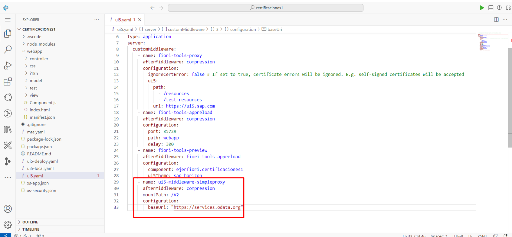

# Pasos para consumir un servicio OData remoto

Se va utilizar el servicio Northwind OData disponible públicamente ubicado en https://services.odata.org/V2/Northwind/Northwind.svc/
 

### Paso 1: Abra una nueva terminal en la carpeta raíz de su aplicación

1. En la izquierda *Explorer panel*, desplegue el menu principal. Seleccione *Terminal* haga click en *New Terminal*.

   
   

2. Instale una nueva dependencia de desarrollo en su archivo package.json. Agregue las siguientes lineas en la *Terminal*:  **npm i -D ui5-middleware-simpleproxy** y presione la tecla enter. 

   

   

### Paso 2: Abra el archivo ui5.yaml y agregar la configuracion de proxi

1. En la izquierda *Explorer panel*, haga clic en **ui5.yaml**.
   
   

2. Agregue la siguiente configuracion de proxi debajo de la ultima linea *ui5Theme: sap_horizon*.
   
   
     
   

### Paso 3: Agregue configuracion de fuente de datos y modelo dentro del manifest.json.
   
1.  En la izquierda *Explorer panel*, despliegue la carpeta **webapp** seleccione el archivo **manifest.json**. Ubicar la seccion de *sap.app* y agregue la siguiente configuración de fuente de datos.
   
   

   

2. Ubicar la seccion *sapui5* y en *models* agregar el modelo con referencia a la fuente de datos.

   

 
