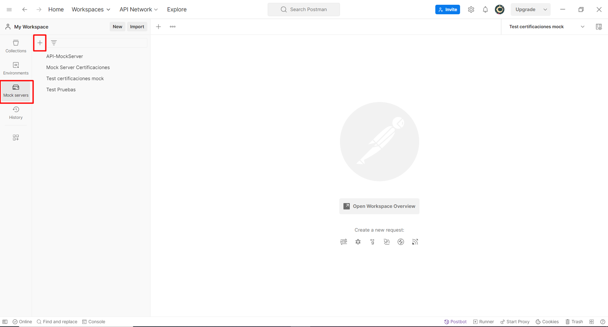
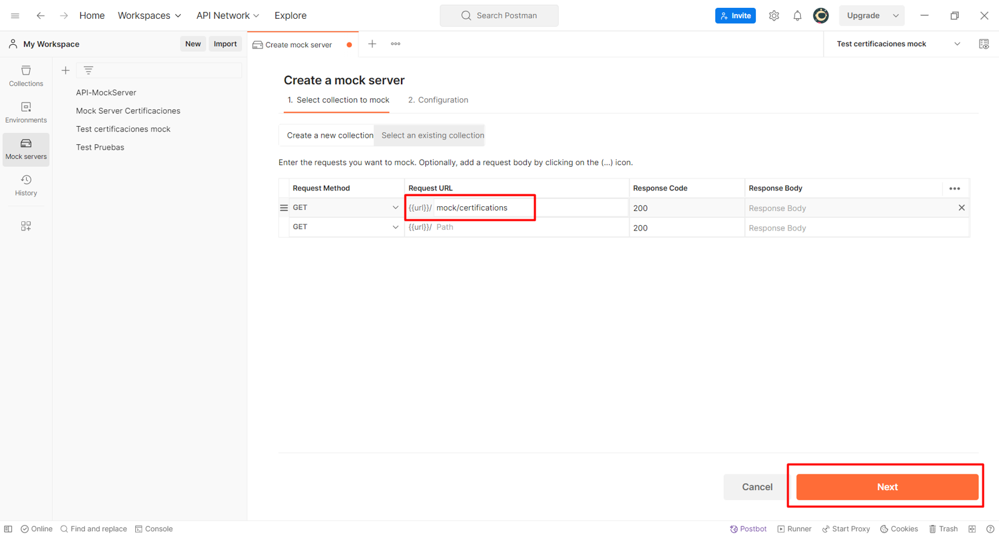
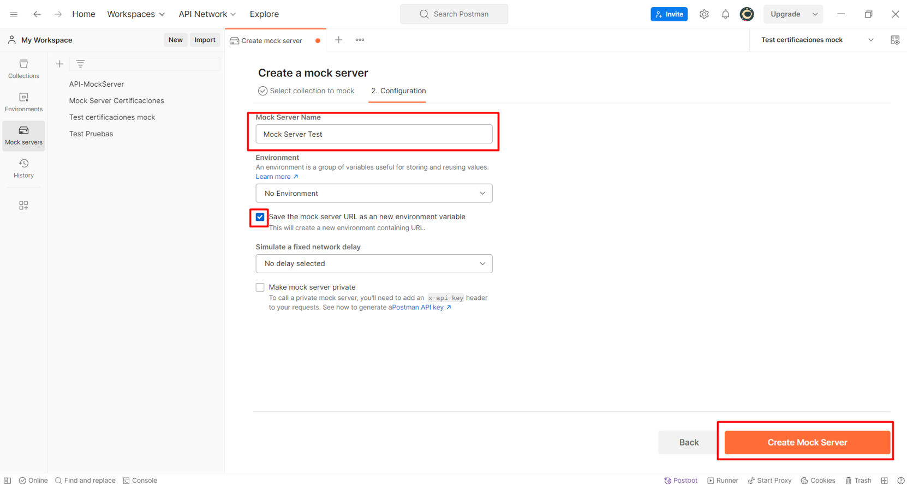
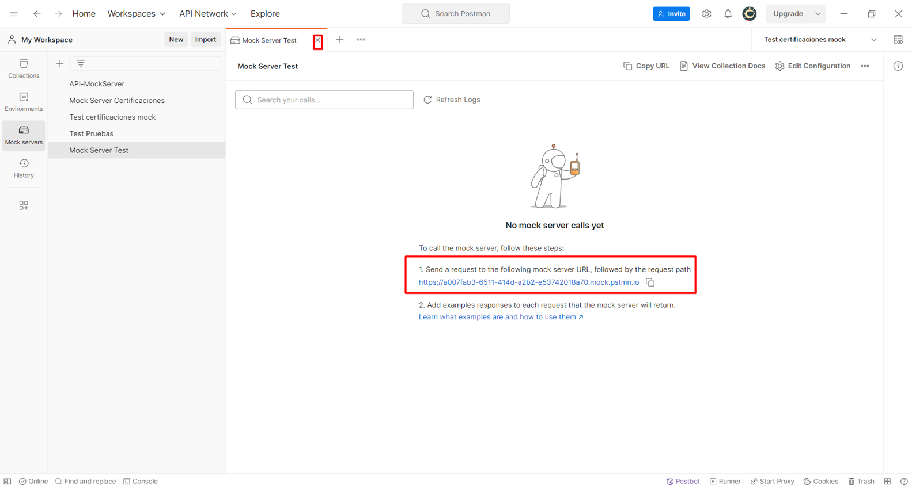
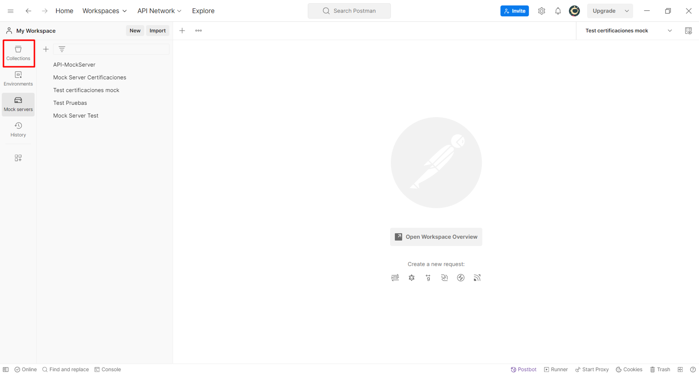
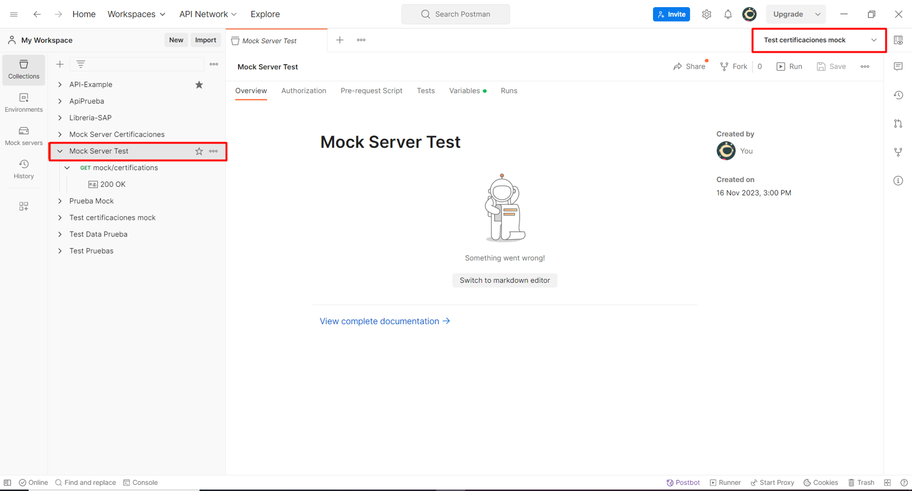
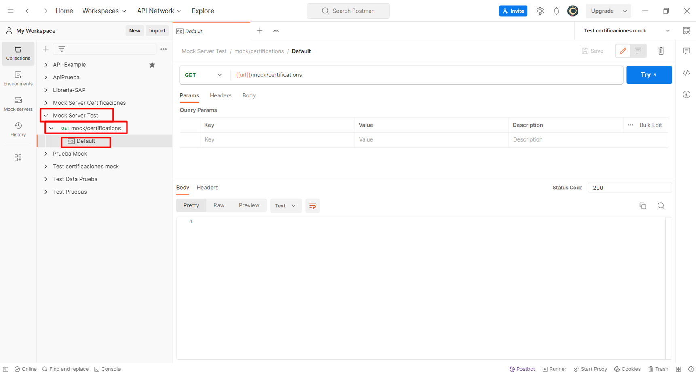

# Pasos para crear un mock server usando postman

 

### Paso 1: Abra postman y cree un mock server

1. En la izquierda del workspace seleccione *Mock servers*, luego click en boton *Create mock server*.

   
   

2. Agregue una URL y seleccione el boton *Next*. 

   

3. Asigne el nombre de su mock server y active el check *Save the mock server URL as an new environment variable*, esto permite crear un nuevo Environment. Seleccione el boton *Create Mock Server*.

   

4. Copie la URL de su mock server y guardela, sera usada mas adelante. Cierre la pestaña.

   

5. En la izquierda del workspace click en *Collections*, podra visualizar la lista de todas sus colecciones.

    

6.  En la lista de colecciones ubique y seleccione su mock server. En la parte superior derecha de su workspace despliegue la lista de environments y seleccione
    el que corresponde a su mock server (Debe tener el mismo nombre). Nota: en mi caso use un environment que ya estaba creado.

    

7. Despliegue la coleccion *Mock Server Test*, la *Get mock/certifications* y abra el ejemplo *Default*.

   
   
