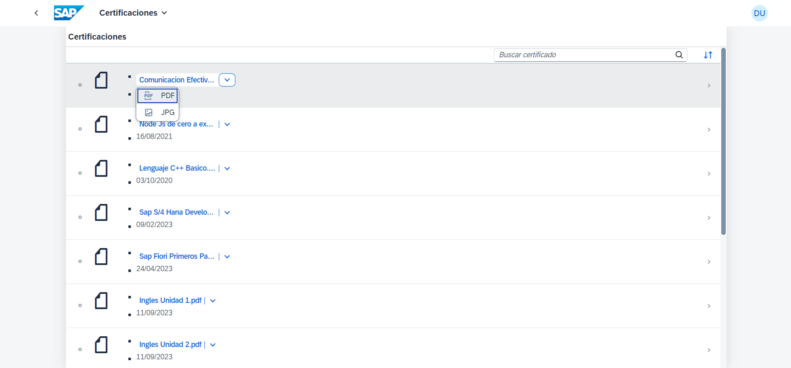

# Agregar componentes de SAPUI5 SDK 

 

### Paso 1: Abra la vista de su aplicacion y agregue los componentes de sapui5

1. En la izquierda *Explorer panel*, despliegue la carpeta *webapp* despues la carpeta *view*, haga click al archivo **listaCertificados.view.xml** 

   
   

2. Agregue los componentes para la lista. Entre los mas relevantes tenemos: **OverflowToolbar**, **SearchField**, **List**, **CustomListItem** y **MenuButton**.

   

   Puede consultar y explorar toda la informacion de los componentes en esta [documentacion de SAPUI5 Demo Kid](https://sapui5.hana.ondemand.com/).

### Paso 2: Agregue la configuracion para consumir datos del mock server

1.  En la izquierda *Explorer panel*, haga click en **manifest.json**. Ubicar la seccion *sap.ui5*, agregue un modelo con la configuracion que se muestra en la imegen. En este caso el modelo se llama *certifications*, la URI corresponde a la URL copiada y guardada en el punto 2.1, se le concatena */mock/certification* del metodo get.

   

2. Seleccione los campos que se van mostrar en su UI, tomelos de su JSON data.  

    

3. Regrese a su vista **listaCertificados.view.xml**, agregue el modelo y los campos seleccionados en el paso anterior. Obseve la imagen se agrego el modelo a la propiedad *items* de la lista y en las propiedades de *texto* los campos que se van a mostrar. 

    

4.  Si dejo el preview activo deberia ver la lista cargada con los datos de su mock server. Aqui puede observar como se ven los componentes agregados en la vista.

    

